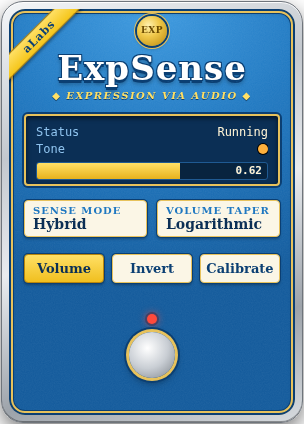
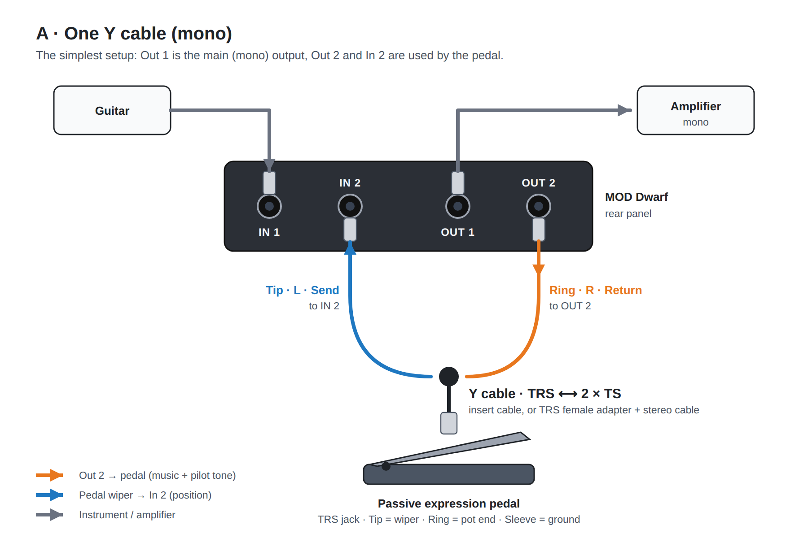
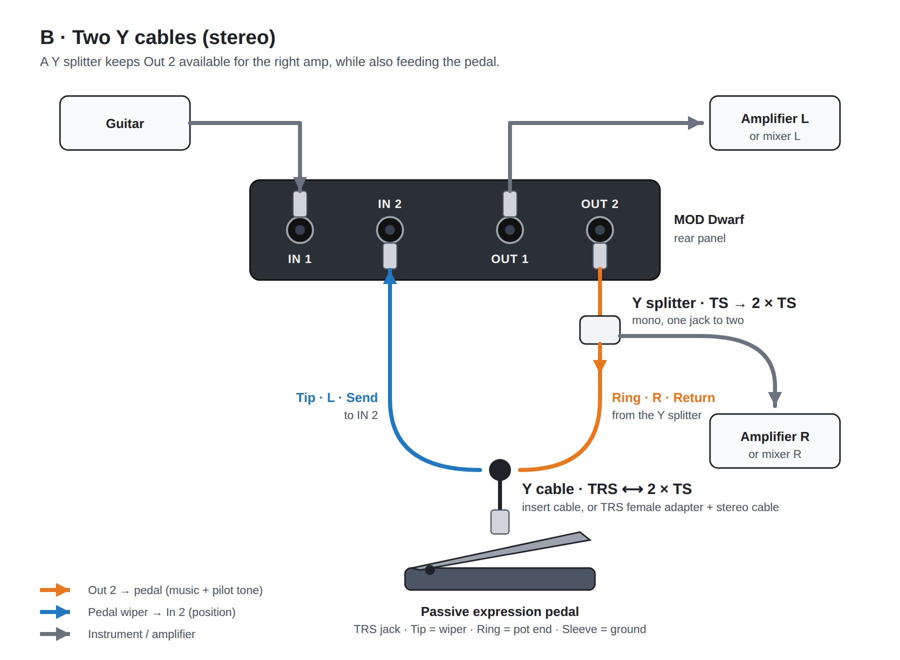
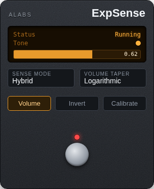

# ExpSense (aLabs) — LV2 prototype

Reads a **passive** expression pedal using nothing but audio I/O. No electronics, just a couple of standard adapter cables.

<p align="center"></p>

## Connecting the pedal

Two wiring options, depending on whether you need Out 2 for your own audio:





- **A · One Y cable (mono)**: the simplest. Out 1 is your main output (mono), Out 2 and In 2 are dedicated to the pedal.
- **B · Two Y cables (stereo)**: keeps the stereo pair. A mono Y splitter on Out 2 sends the signal both to the right amp/mixer channel and to the pedal.

The vector sources (`docs/*.svg`) can be used directly in a printed manual.

### What pedal

Any **passive** expression pedal with a TRS (stereo) 1/4" jack, i.e. just a potentiometer (typically 10–50 kΩ) with no battery or power supply, for example Roland EV-5, Yamaha FC7, Moog EP-3 or M-Audio EX-P. Active, USB or MIDI pedals will not work.

A plain **passive volume pedal** (mono in/out, e.g. 250 kΩ) also works: connect Out 2 to its input and its output to In 2 with two ordinary instrument cables. Its log taper can be compensated with the *Curve* parameter (see [The Curve parameter](#the-curve-parameter)).

### Find the wiper

The pedal's TRS jack carries the two ends of the pot and the wiper. ExpSense needs the **wiper on In 2**. Most pedals ("Roland/standard" polarity) use:

| TRS contact | Function | Goes to |
|---|---|---|
| Tip | wiper | Dwarf **In 2** |
| Ring | pot end | Dwarf **Out 2** |
| Sleeve | pot end / ground | ground (sleeve of both plugs) |

Some brands (e.g. Korg, some Kurzweil) swap Tip and Ring, and pedals like the M-Audio EX-P have a polarity switch: set it to "Roland/standard". If in doubt, measure with a multimeter: the resistance between the two pot ends stays constant as you move the pedal, while the wiper-to-end resistance changes.

### Cables

**Y cable TRS ⟷ 2 × TS** (needed in both setups). It joins the pedal's TRS jack to two mono jacks on the Dwarf. Either of these works:

- an **insert cable**: TRS male plug (into the pedal) to two TS male plugs;
- a **TRS female to 2 × TS male Y adapter** (e.g. pro snake TPY 2003 BPP), plus an ordinary **stereo TRS cable** from the adapter to the pedal. Handy because you keep your usual pedal cable.

Its two mono legs carry:

| Leg | Insert-cable name | Y-adapter name | Goes to |
|---|---|---|---|
| Tip | *Send* (often red) | **L** | Dwarf **In 2** |
| Ring | *Return* | **R** | Dwarf **Out 2** (setup A) or the Y splitter (setup B) |

Sleeve is shared by both legs. If your pedal has reversed polarity, swap the two legs.

**Y splitter TS → 2 × TS** (setup B only). A plain mono Y cable (e.g. Cordial CFY 0,3 GPP, check that the genders of its jacks match your cables) on Out 2: one leg goes to the right amp or mixer channel, the other leg to the Ring/R leg of the Y cable above.

A plain TS mono instrument cable to the pedal **will not work**: it only connects Tip and Sleeve, so the pot end never receives any signal.

### Levels and settings on the Dwarf

- The pot is a passive divider, so In 2 can at most receive the level coming out of Out 2. Set the **In 2 gain** so that a full-scale output does not clip the input. Unity gain or less is a good start.
- The pot (10–50 kΩ) in parallel with the amp input is a negligible load for a line output.
- A high-impedance input (instrument setting) gives the most linear response. On a low-impedance input the curve bends, which can be corrected with the *Curve* parameter (see [The Curve parameter](#the-curve-parameter)).
- Heel and toe are learned by the calibration, so the direction is always right. *Invert* is only there if you want the pedal to work the other way round.
- Run **Calibrate** again whenever you change pedal, cable or In 2 gain.

## Principle of operation

An expression pedal is just a potentiometer: two fixed ends and a wiper that moves with the pedal. Normally a controller feeds a DC voltage into it and reads the voltage on the wiper. Audio interfaces cannot read DC (their inputs are AC-coupled), but they are very good at measuring AC signals. So ExpSense uses the pot as an **audio attenuator**:

1. One end of the pot is fed with an audio signal coming from one of the Dwarf's outputs (Out 2). The other end goes to ground.
2. The wiper returns a scaled-down copy of that signal to one of the Dwarf's inputs (In 2).
3. The plugin knows exactly what it sent and measures what came back. The ratio **g = returned / sent** is the pot's divider ratio, which means the pedal position.

The signal used for the measurement can be:

- **the program itself**, i.e. the guitar sound already going to Out 2. Nothing is added, but it only works while you are playing.
- **a pilot tone** at ~19 kHz and very low level (−50 dBFS by default), added to Out 2. It is at the edge of hearing and way below the music, and it works even in silence or with the volume at zero.

Because the signal takes a trip out through the DAC and back through the ADC, the returned copy is delayed by a few milliseconds. ExpSense measures this round-trip latency once, during calibration, and compensates for it. The same guided calibration also checks the wiring and learns the heel and toe readings of your pedal, so the output always covers the full 0–1 range in the right direction.

The resulting position is then available as a CV signal, as a MIDI CC, and, optionally, as a built-in stereo volume control applied directly to the audio passing through the plugin.

## Pedalboard routing (in the MOD editor)

This section is about the **virtual** connections you draw in the pedalboard editor (web UI); the physical cables are covered in *Connecting the pedal*. ExpSense is a stereo plugin with one extra audio input, *Sense*, that reads the pedal:

```
 pedalboard editor
 ─────────────────────────────────────────────────────────────────────────
  Capture 1 ─► effects ─► … ─┬─► In L                    Out L ─► Playback 1
                             └─► In R    [ExpSense]      Out R ─► Playback 2
  Capture 2 ─────────────────────► Sense                 CV / MIDI ─► (optional)
```

| ExpSense port | Connect to | Notes |
|---|---|---|
| **In L / In R** | the end of your chain (both from the same mono source is fine) | the volume is applied here |
| **Out L** | Playback 1 | main output |
| **Out R (amp + pedal)** | Playback 2 | this is what feeds the pedal; must go **directly** to Playback 2 |
| **Sense (pedal wiper)** | Capture 2 | connect **nothing else** to Capture 2 |
| CV / MIDI | optional | to modulate other plugins or external gear |

Rules:

- **Last in the chain.** ExpSense compares what it sends to Playback 2 with what comes back on Capture 2, so nothing may sit between *Out R* and Playback 2: no effects, no other connections mixed into Playback 2.
- **Capture 2 is the sensor, not an instrument input.** Remove every other connection from Capture 2, including the direct Capture 2 → Playback 2 link of a new empty pedalboard: it would feed the pedal signal back to Out 2 (a feedback loop), and anything routed from Capture 2 into your chain would carry the pilot tone and the returned music.
- **Playback 2 receives only *Out R*.** For the same reason, no other plugin or capture may be connected to Playback 2.
- **The volume acts on L and R** with the same gain. The pilot tone and the calibration noise are added to *Out R* only; *Out L* stays clean.
- **Mono setup (cable A):** Out 2 drives only the pedal, so use Playback 1 as your output; *Out R* still goes to Playback 2.
- **Stereo setup (cables B):** Playback 2 also reaches the right amp through the Y splitter. The pilot tone is ~19 kHz at a low level and is only on when the music is too quiet (Hybrid mode).

To use the pedal on another plugin (e.g. a wah), take the **CV** output to that plugin's CV input, or address the parameter through MIDI. The wah sits **before** ExpSense in the chain, so the CV goes "backwards" in the graph; whether mod-host accepts this without an extra period of latency is still to be verified on the Dwarf (see *Known limits*).

## How the position is estimated

The divider gain is g = sense / out. Two estimators are fused, each weighted by the energy available to it:

- **Program**: least-squares estimate on the output signal (20 Hz–2 kHz band), with compensation of the (fractional) round-trip latency. It only contributes when correlation is high (ρ > 0.8).
- **Tone**: I/Q lock-in on a ~19 kHz tone, −50 dBFS by default. It is phase-insensitive, so it works even before calibration. A correction factor `tone_k` (learned online) compensates for the different loop response at 19 kHz.

## The Sense Mode parameter

*Sense Mode* selects which reference signal is used to read the pedal.

| Sense Mode | Pilot tone | Reads the pedal while playing | Reads the pedal in silence | Best for |
|---|---|---|---|---|
| **Hybrid** (default) | only when needed | yes (program) | yes (tone) | general use, volume and wah |
| **Tone only** | always on | yes (tone) | yes (tone) | maximum stability, heavy distortion, debugging |
| **Program only** | never | yes (program) | **no**: value is held | setups where any added tone is unacceptable |

**Hybrid.** The plugin reads the pedal from the program whenever the program is strong and well correlated. The pilot tone fades in (10 ms) as soon as the program is not enough, which happens when:

- the program level drops below about −60 dB (you stop playing, a note dies out, or the volume pedal is near heel-down);
- the correlation between sent and returned signal drops (ρ < 0.85);
- the round-trip latency has not been measured yet (no calibration).

The tone switches off again only after the program has stayed strong (above about −52 dB, with ρ > 0.92) for 150 ms. This hysteresis avoids chattering on decaying notes. While the tone is fading in or out, both estimators are blended by their energy, so the reading does not jump. In practice, the tone is off while you play and on during pauses. Since it is added *after* the volume stage, it keeps the pedal readable even with the volume fully down.

**Tone only.** The pilot tone is always present at the *Tone Level* setting, and the reading always comes from it (the program still contributes when present). The reading does not depend on what you play, so it is the most consistent option with very dense or distorted material, or when you want to rule out the program estimator while debugging. The trade-off is that the tone is always there. Keep *Tone Level* as low as it will go while *Reference Level* stays well above the floor.

**Program only.** No tone is ever added, except during calibration, which always uses the tone and a short noise burst. The pedal can be read only while there is signal on Out 2. In silence the last value is held (*Status* shows *Hold*), and the new position is picked up at the first note. This is fine for a wah or for modulation parameters. **Do not use it together with Volume**: at heel-down the output is silent, the pedal can no longer be read, and the volume cannot come back up.

Related parameters:

- **Tone Freq** (12–21 kHz, default 19 kHz): pilot tone frequency. Keep it above hearing but below the sample rate limit (it is clamped to 0.45 × sample rate).
- **Tone Level** (−70 to −20 dBFS, default −50): pilot tone amplitude. Lower is less audible but noisier. Check *Reference Level* to see how much signal the estimator has.

## Calibration ("Calibrate" button)

One button does everything: it checks the wiring, measures the round-trip latency, and learns the heel and toe readings of your pedal (including its direction). *Calibrate* is a momentary (trigger) button: press it once, and follow the status line. The calibration **ends by itself**, the button stays lit while it runs, and it can also be assigned to a Dwarf footswitch.

Keep the strings muted during the calibration. Playing works too, because pick attacks are detected and skipped, but a quiet signal gives the cleanest reading.

| Status line | What to do | What the plugin does |
|---|---|---|
| *Cal: keep heel down…* | put the pedal heel-down **before** pressing, and keep it there | reads the heel value (~0.7 s) |
| *Cal: move to toe, hold…* | move the pedal to toe-down and hold it | waits until the pedal is held still at toe |
| *Cal: hold at toe…* | keep holding toe-down (~3 s) | reads the toe value, measures the latency (you hear a −40 dBFS hiss), learns `tone_k` |
| *Cal: back to heel…* | bring the pedal back to heel-down | checks the return, then stores the calibration |

The pilot tone is raised to −30 dBFS for the whole calibration. The result is shown on the status line for 10 seconds, and stays on the *Calibration Result* output port:

| Result | What it means | What to do |
|---|---|---|
| **Cal: OK** | calibration stored | nothing |
| **Cal: OK, check wiring** | calibration stored, but the heel end stays above 20% of the toe end. Most likely Tip and Ring are swapped: on the Dwarf's In 2 a swapped pedal still moves enough to calibrate, but its response is compressed and non-linear (e.g. 0.76 at mid travel instead of ~0.5) | swap the two insert-cable plugs (or flip the pedal's polarity switch) and calibrate again. If your pedal has a *minimum* trimmer, turn it fully down first: it also lifts the heel end |
| **Cal: OK, In 2 level low** | calibration stored, but very little comes back | raise the In 2 gain and calibrate again |
| **Cal: swap Send/Return** | the reading stayed high and barely moved: Out 2 is feeding the wiper (or the pedal was not moved) | swap the two insert-cable plugs, or set the pedal's polarity switch to "standard" |
| **Cal: no signal** | nothing comes back on In 2 | check that the cable is TRS (not mono TS) and that the pedal is passive. A pedal with its wiper on the sleeve cannot be used with this cable |
| **Cal: In 2 clipping** | the input is overloaded | lower the In 2 gain and calibrate again |
| **Cal: no latency, retry** | the latency could not be measured within 8 s | calibrate again, holding toe-down firmly |
| **Cal: toe not held, retry** | toe was reached but left before the latency was measured | calibrate again, and wait for *back to heel* before moving |
| **Cal: aborted** | *Calibrate* was pressed again | nothing |

On any failure the previous calibration is kept unchanged. Timeouts: 8 s to reach toe, 8 s for the latency measurement. Not coming back to heel is not an error: after 8 s the calibration is stored anyway.

**Heel first.** The plugin cannot tell heel from toe by itself: it assumes the pedal is heel-down when you press the button. If you start toe-down, the pedal will work the other way round. Calibrate again, or use *Invert*.

Latency, heel/toe values and `tone_k` are saved in the LV2 state, and therefore in the MOD pedalboard.

## Parameters

Controls marked **face** are on the plugin's pedal face; all the others are in the MOD settings panel. Every control also has a short description, shown as a tooltip in the MOD web GUI.

| Parameter | Range | Default | What it does |
|---|---|---|---|
| **Sense Mode** (face) | Hybrid / Tone only / Program only | Hybrid | Which reference is used to read the pedal. See [The Sense Mode parameter](#the-sense-mode-parameter). |
| **Tone Freq** | 12–21 kHz | 19 kHz | Pilot tone frequency. Keep it above hearing and within what your amp or PA reproduces cleanly. It is limited to 0.45 × the sample rate. |
| **Tone Level** | −70 to −20 dBFS | −50 dBFS | Pilot tone level. Lower is less audible but gives a noisier reading. During calibration it is raised to at least −30 dBFS. |
| **Smoothing** | 0.5–100 ms | 3 ms | Smoothing of the pedal value. Short for a fast wah, longer for a smooth volume. |
| **Curve** | 0.25–4 | 1 (linear) | Response curve of the pedal value. See [The Curve parameter](#the-curve-parameter). |
| **Invert** (face) | off / on | off | Reverses the pedal (toe = 0, heel = 1). The calibration already learns the right direction, so this is only a preference. |
| **Volume** (face) | off / on | off | Uses the pedal as a stereo volume control on both outputs. |
| **Volume Taper** (face) | Logarithmic / Linear | Logarithmic | Volume response. Logarithmic is an audio taper (about −30 dB at mid travel, true silence at heel); Linear is gain = value. |
| **Calibrate** (face) | button | — | Starts the guided calibration (heel → toe → heel). Press again to abort. See [Calibration](#calibration-calibrate-button). |
| **MIDI Channel** | 1–16 | 1 | Channel of the MIDI CC output. |
| **MIDI CC** | 0–119 | 11 (Expression) | CC number of the MIDI output. |
| **MIDI 14-bit** | off / on | off | Sends a 14-bit CC (MSB on CC, LSB on CC + 32). Only for CC numbers below 32. |

### The Curve parameter

*Curve* reshapes the pedal response by raising the calibrated position (0 at heel, 1 at toe) to a power:

`value = position ^ Curve`

The two ends never move (heel always gives 0, toe always gives 1); only the way the value travels between them changes.

| Curve | Value at mid travel | Feel |
|---|---|---|
| **1** (default) | 0.50 | linear: the value follows the pedal |
| **0.5** | 0.71 | fast at the start, finer control near toe |
| **0.33** | 0.79 | even faster at the start |
| **2** | 0.25 | slow at the start, finer control near heel |
| **3** | 0.13 | most of the change happens near toe |

*Curve* acts on everything the plugin produces from the pedal: CV, MIDI CC and the built-in volume (where it is applied before *Volume Taper*).

Typical uses:

- **Passive volume pedal used as an expression pedal.** Most volume pedals have a logarithmic ("audio taper") pot, so the reading stays low for most of the travel and jumps near toe; at mid travel it may read only 0.1–0.2. A *Curve* around **0.3–0.5** brings the response back to roughly even. (It is an approximation: a power curve does not match a log taper exactly.)
- **Bent response on a low-impedance input.** If In 2 loads the pot noticeably, the reading sags in the middle (e.g. 0.3 at mid travel instead of 0.5). A *Curve* slightly below 1 straightens it.
- **Taste.** On a wah, a *Curve* above 1 gives more resolution in the heel (bass) region; below 1 gives more in the toe (treble) region.

To check: calibrate, put the pedal at mid travel, and adjust *Curve* until the value bar reads about 0.50.

## Outputs

- **CV** 0–10 (mod:CVPort): connect it to the wah parameter.
- **MIDI CC**: 7-bit, or 14-bit (MSB on cc, LSB on cc+32, only for cc < 32). Sent only on changes, at most every 2 ms.
- **Volume**: with the "Volume" toggle on, the position is applied as gain to both outputs. *Volume Taper* selects the response:
  - **Logarithmic** (default): audio-taper law `g = (10^(3·v) − 1) / (10^3 − 1)`. It behaves like a ~60 dB range in dB, is about −30 dB at mid travel and reaches true silence at heel-down, so swells start from zero.
  - **Linear**: `g = v`.

  The tone is added *after* the volume, so the pedal stays readable even heel-down.
- **Monitors**: Value, Raw Gain, Tone Active, Status, Loop Latency, Cal Min/Max, Reference Level, Volume Gain (linear gain actually applied to the audio), Calibration Result.

## GUI

The bundle includes an image-free modgui, because the default MOD GUI does not show output ports at all: mod-ui only monitors the outputs listed in `modgui:monitoredOutputs` and hands them to the modgui's JavaScript.

Two themes are available. Both have the same controls; you choose one at build time with `UI=` (see *Build*).

| `UI=classic` (default) | `UI=tin` |
|---|---|
|  |  |

- **Display**: one status line, a dot that lights up while the pilot tone is on, and a bar with the pedal value. During calibration the status line guides you step by step. When the calibration ends, it shows the result (*Cal: …*, green if OK, orange otherwise) for 10 seconds, then goes back to the plugin status.
- **Face controls**: Sense Mode, Volume Taper, Volume, Invert, Calibrate (lit while calibrating), bypass.
- All other parameters (tone, smoothing, curve, MIDI) are in the standard settings panel.

Source layout:

```
expsense.lv2/            TTL files and modgui/script-expsense.js (shared by all themes)
ui/base.css              base stylesheet (the classic theme)
ui/<theme>/              icon-expsense.html, screenshot and thumbnail;
                         optional theme.css, appended to base.css
build/expsense.lv2/      the assembled bundle (generated by make)
```

To add a theme, create `ui/<name>/` with these files and build with `UI=<name>`.

## Build

The bundle is assembled in `build/expsense.lv2` (plugin, TTL and the chosen modgui theme).

```
make LV2_CFLAGS=-I/path/to/lv2/include           # host, classic theme
make LV2_CFLAGS=... UI=tin                       # host, tin theme
make CC=aarch64-linux-gnu-gcc LV2_CFLAGS=...     # Dwarf (or mod-plugin-builder)
make test LV2_CFLAGS=...                         # simulation
```

Hot install on the Dwarf, without restarting (the plugin must not be in the current pedalboard):

```
make CC=aarch64-linux-gnu-gcc LV2_CFLAGS=... publish                    # Dwarf at 192.168.51.1 (USB)
make CC=aarch64-linux-gnu-gcc LV2_CFLAGS=... UI=tin publish             # tin theme
make CC=aarch64-linux-gnu-gcc LV2_CFLAGS=... publish DWARF=192.168.52.1 # other address
```

`publish` checks that the binary is an aarch64 build, packs `build/expsense.lv2` as base64 tar.gz, and posts it to mod-ui's `/sdk/install`. It fails with an error message if mod-ui refuses the install, which typically happens when ExpSense is still in the current pedalboard. The theme is rebuilt on every `make`, so switching `UI=` only needs a new `publish`; reload the web UI to see it.

## Simulation (test/sim.c)

The simulated loop has: 317.37-sample latency, windowed-sinc fractional delay, FIR [0.85 0.15] (−2.6 dB at 19 kHz), pot 5–95%, loop gain 0.7 and −90 dBFS noise.

| segment | mean err | max err | tone |
|---|---|---|---|
| wah, playing | 0.007 | 0.016 | 0% |
| wah, pause | 0.013 | 0.028 | 100% |
| wah, distorted | 0.007 | 0.014 | 0% |
| volume heel-down | 0 | 0 | 100% |
| volume swell (log law) | 0.007 | 0.012 | 78% |

Measured latency 317.52 (expected 317.37 + 0.15 from the FIR). The calibration ends by itself ~0.3 s after the pedal is back at heel. CPU ~100 ns/sample on x86.

The calibration is then run against ten cases, all handled correctly: standard wiring, heel reading high (direction learned: heel reads 0 afterwards), Tip/Ring swapped (high-impedance input: detected as swap; low-impedance input as on the Dwarf: calibrated with a wiring warning), no signal, In 2 clipping, In 2 level low, pedal never moved, toe not held, and a second press (abort). The whole suite also passes with 20 different random guitar signals. `make test` returns a non-zero exit code if any case fails.

## Known limits / to verify on the Dwarf

- **Graph loop**: if the CV drives a wah placed *before* ExpSense, a loop is created. How mod-host handles it still needs checking (probably with a one-block delay).
- **19 kHz tone**: with FRFR/PA/in-ear monitoring, or with analog drives after the Dwarf, lower Tone Level or use Program only.
- **Disconnected pedal**: detected as raw < 0.4·min, but only if the calibrated min is > 0.02 (i.e. the pedal has a series resistor). Otherwise it cannot be told apart from heel-down.
- **Two-point calibration**: input loading on the pot (low-impedance line-in) makes the curve non-linear. It can be corrected by ear with Curve; a multi-point LUT is still missing.
- **CV range**: 0–10 is the mod-cv-plugins convention, yet to be confirmed.
- **Heavy continuous playing during calibration**: pick attacks are skipped, but constant dense high-frequency content (e.g. sustained fuzz) could keep the reading frozen until a timeout. Mute the strings while calibrating.
- **Wiring check on low-impedance inputs**: with swapped Tip/Ring and a low-impedance input, the returned level can vary enough to look like a valid pedal. The Dwarf's instrument inputs are high impedance, so this should not happen there.
